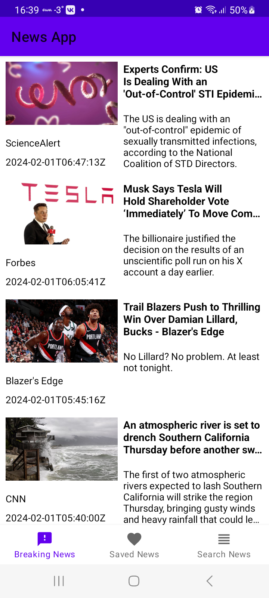
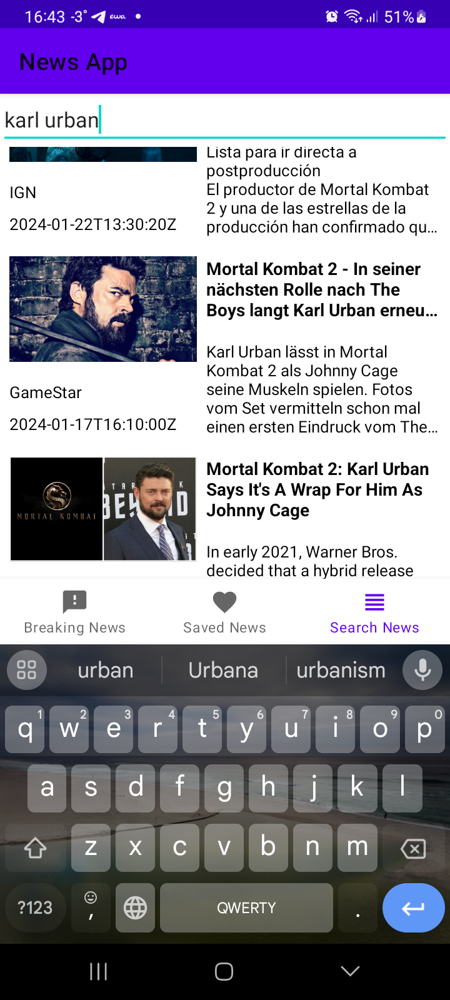

# MVVM News App 

Тестовый проект с архитектурой **MVVM**, который подгружает новости с открытого новостного API. 

Писался как codealong, чтобы получить общее представление об архитектуре MVVM.

## Стек
- Для обращения к публичному [NewsApi](https://newsapi.org/) используется библиотека **Retrofit**
- Избранные статьи сохраняются в локальную бд с помощью **Room**
- "Тяжелые" операции типа запросов к сети и обращение к БД запускаются в **корутинах**
- Все фрагменты получают данные из **общей вьюмодели** 
- Список статей грузится в **LiveData**, так чтобы они автоматически обновлялись во фрагментах-подписчиках
- Навигация работает на **Navigation Component** + **Bottom Navigation View**
- Все новости грузятся в **RecyclerView**, который использует **DiffUtil**, чтобы эффективнее подгружать список.
 
## Скриншоты и функции

В приложении три вкладки.  
**Вreaking News** подгружает последние новости с NewsApi при запуске приложения. На любую новость можно кликнуть и она откроется в новом фрагменте с WebView. Во фрагменте есть FAB кнопка, по клику на которую новость сохраняется в Saved  
Во вкладке **Search News** есть EditText для поиска новостей по ключевым словам. Поиск выполняется автоматически, с задержкой в полсекунды.  
**Saved News** отображает сохраненные новости, которые подгружаются из локальной бд через Room. Новость можно удалить, смахнув влево или вправо.

*** Исходный проект: [Philip Lackner MVVM News app](https://www.youtube.com/playlist?list=PLQkwcJG4YTCRF8XiCRESq1IFFW8COlxYJ)
